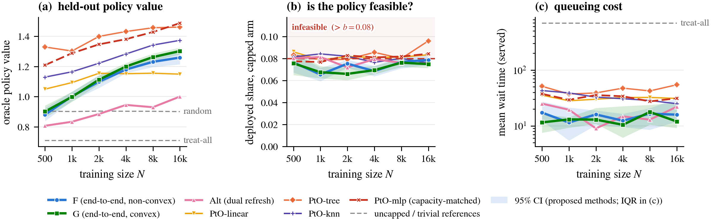
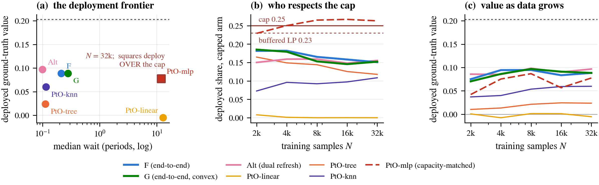
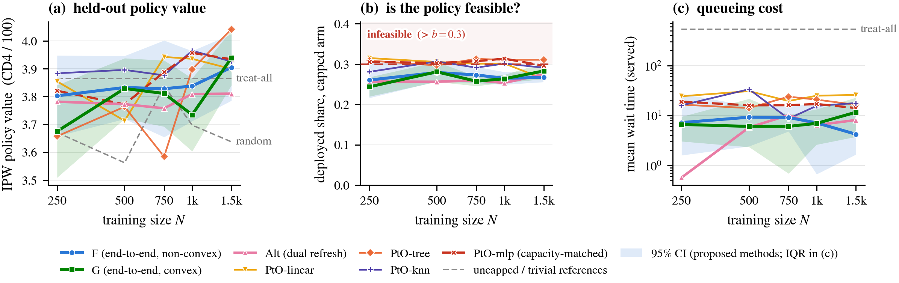
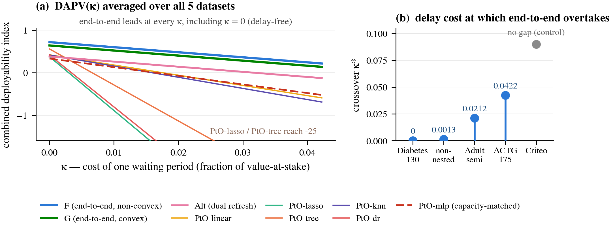
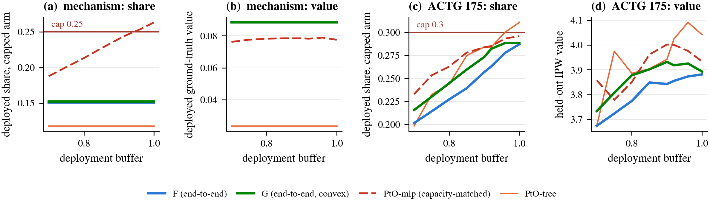

<h1 align="center">Differentiating Through Dual Prices</h1>

<p align="center"><i>Train the outcome model through the capacity prices it induces, so the deployed policy and the trained policy are the same object — then measure what that buys when allocations meet a live queue</i></p>

<p align="center">


</p>

<p align="center"><sub>Code for the a confrance submission <i>Differentiating Through Dual Prices: End-to-End Policy Learning Under Capacity Constraints</i>.</sub></p>

---

<h2 align="center">The Question</h2>

A clinic, a benefits office, a housing program: each learns from logged data who should get which
treatment, and each treatment arm has a capacity. The standard pipeline is decision-blind — fit
outcome models per arm, price the capacities with a linear program afterwards, deploy the
price-adjusted argmax. Nothing in that pipeline links what the models learn to what the prices
need, and the constraint is met on paper by a pricing step the models never saw.

This repository trains the model **through** the prices instead: the shadow prices are re-solved
at every gradient step as an implicit function of the model, and the policy value gradient flows
through that solve. Three questions, one experiment suite for each.

| | Question | Answer |
|---|---|---|
| **1. Value** | Does building feasibility into training cost outcome value? | No — it adds it. Value ties on the real trials and becomes an outright, highly significant win at scale (+0.045, t = 9.2) |
| **2. Feasibility** | Is what the LP promises what the queue delivers? | Only for the price-trained policies. Decision-blind baselines deploy at or above cap and pay for it in waiting time |
| **3. Substitutes** | Can a deployment knob — a tighter buffer, a variance fix, no constraints at all — buy the same thing? | No. Each substitute is run and fails for its own measured reason |

---

<h2 align="center">Headline Results</h2>

<div align="center">

| Raw-value win | Median waits | Index crossover |
|:---:|:---:|:---:|
| **+0.045** (t = 9.2) | **4–12 vs 14–25** | **κ = 0** |
| F over the best decision-blind pipeline on Diabetes 130-US, 48,981 patients, 10 seeds | waiting periods, end-to-end vs decision-blind on the ACTG 175 trial — where raw values tie | F leads the deployment-adjusted index at every delay aversion (0.72 vs 0.56 for the best decision-blind method at κ = 0) |

</div>

---

<h2 align="center">The Method</h2>

Given a log $(X_i, T_i, Y_i, \hat e_{T_i}(X_i))_{i=1}^N$ over $|\mathcal T|$ treatments with
capacities $b_t$ (fraction of the population arm $t$ can absorb; control unconstrained), maximize
the IPW policy value

$$\hat V_{\mathrm{IPW}}(\theta) = \frac{1}{N}\sum_{i=1}^N \pi_{\theta,T_i}(X_i)\,\frac{Y_i}{\hat e_{T_i}(X_i)}$$

over the softmax dual-price policy class

$$\pi_{\theta,t}(x) = \mathrm{softmax}_t\big((m_{t,\theta}(x)-\mu_{\theta,t})/\tau\big),$$

where the shadow prices $\mu_\theta \ge 0$ solve an inner capacity-pricing problem for the current
scores — a bilevel program, differentiated through the inner argmin.

| Name | Inner objective | Gradient path | Where |
|------|-----------------|---------------|-------|
| **F** | $F(\mu)=\frac1N\sum_i \sigma_i(\mu)^\top(M_i-\mu) + b^\top\mu$ — the literal softmax Lagrangian, non-convex | L-BFGS-B forward, implicit-function theorem backward on the KKT system | `src/inner_F.py` |
| **G** | $G(\mu)=\frac\tau N\sum_i \log\sum_t e^{(M_{it}-\mu_t)/\tau} + b^\top\mu$ — convex log-sum-exp dual | CVXPYLayer (diffcp), or the same L-BFGS-B + IFT path (`Gs`, no cvxpy in the loop) | `src/inner_G.py` |
| **Alt** | same as F | block-coordinate: $\mu$ refreshed every few steps and treated as a constant — no implicit gradient | `src/train_alt.py` |
| **PtO-\*** | decision-blind reference: fit $\hat m_t$ per arm (OLS / lasso / tree / kNN / DR / MLP), solve the sample dual LP, deploy $\arg\max_t \hat m_t(x)-\hat\mu_t$ | none | `src/s2_dual.py` |

The two inner objectives satisfy $F \le G \le F + \tau\log|\mathcal T|$ — they differ by exactly
the policy entropy — and both collapse to the hard LP dual as $\tau \to 0$. The property that
matters: **G**'s stationarity condition is $b_t = \frac1N\sum_i \pi_{t,i}$ on binding arms, so its
inner optimum is feasible-in-expectation *exactly*, by construction, with no capacity penalty in
the outer objective. F's stationary point can exceed caps at finite $\tau$ (measured: 1.1% at
$\tau=0.01$ up to 28.2% at $\tau=1$), which is why deployment re-prices through a sub-capacity
buffered LP and everything is scored inside a discrete-event queueing simulation. All of it is
unit-tested against finite differences (`tests/`). Result CSVs use the legacy `S2-*` tags for the
PtO baselines.

---

<h2 align="center">1. Ground Truth: What Each Pipeline Wins</h2>

On the Adult semi-synthetic suite (real census covariates, eight arms, oracle-scored deployment)
the deployment panels separate immediately: the end-to-end methods hold their deployed shares
under the 0.08 caps and clear their queues in 12–16 periods, while the decision-blind value
leaders buy their numbers by sitting at or above cap and queueing 31–56 periods. The end-to-end
methods overtake the misspecified linear family from N ≈ 4,000, and F beats Alt in 24 of 25
regime cells — the implicit gradient earns its cost. Where flexible regression wins raw value, it
wins it infeasibly; end-to-end is the family that delivers value under the constraint it will
actually be held to.

<p align="center">

<br><sub>Adult semi-synthetic (8 arms, caps 0.08): deployed value, deployed share against cap, and median wait vs training size. 10 seeds, 95% bands.</sub>
</p>

The mechanism dataset shows *why* the pipelines separate, with every failure structural rather
than tuned: a smooth effect driven by a single dense severity direction, positive for 30% of the
population, capped at 25%. The linear family has exactly zero covariance with the effect and
prices the arm out entirely (deployed share 0.000); depth-5 trees cannot express the dense
direction and treat half-blind (value 0.024 vs oracle 0.203); kNN attenuates the margin
(0.060, paired t = 6.9 against F); and the capacity-matched MLP comes closest on value
(0.078 vs F's 0.088) but its margin noise deploys 0.263 against the 0.25 cap — a 12.0-period
median wait against ≤ 0.28 for end-to-end, a 57× gap that survives the buffered LP.

<p align="center">

<br><sub>No baseline reaches the end-to-end corner on both axes at once: every feasible decision-blind method concedes value, and the one competitive on value concedes feasibility.</sub>
</p>

---

<h2 align="center">2. A Real Trial: Values Tie, Deployment Separates</h2>

ACTG 175 randomised 2,139 HIV-positive patients across four antiretroviral arms — known
propensities, clean identification, and a capacity question that is real: cap the
combination-therapy arms at 0.30. On IPW value every learned method ties within noise
(3.90–4.04 at full N). On deployment they do not: every decision-blind baseline deploys the
capped arms at 0.30–0.32, at or above cap, while the end-to-end methods hold 0.24–0.28. The
queue turns that gap into 14–25 waiting periods against 4–12.

<p align="center">

<br><sub>With estimation error removed as a confound by randomisation, what end-to-end training buys is a deployed allocation that respects the constraint it was trained under.</sub>
</p>

---

<h2 align="center">3. Scale, and One Number</h2>

The Diabetes 130-US cohort (69,973 patients after preprocessing, three HbA1c-testing arms,
observational) is where end-to-end takes the headline: the first statistically significant
raw-value win for training through the prices. At N = 48,981, F reaches 0.989 and Alt 0.991 in
held-out IPW value against 0.944 for the best decision-blind method — paired per-seed +0.045
(t = 9.2) and +0.047 (t = 5.7), and +0.051 (t = 9.4) against the capacity-matched MLP control
with the identical trunk, width, steps and learning rate. Both price-trained variants clear every
decision-blind baseline by wide, significant margins, and they deploy the way they trained: under
cap, with 2–6 period median waits against 15–33 for every decision-blind baseline.

The deployment-adjusted policy value (DAPV) index folds value, feasibility and delay into one
number with one swept parameter — the cost κ of one waiting period — with feasibility needing no
weight at all: an infeasible policy mechanically loses value through unserved arrivals and queue
spill-over.

<p align="center">

<br><sub>Pooled over five datasets, normalised so random = 0 and the best method at κ = 0 equals 1. F leads at every κ — the crossover is at κ = 0 — with 0.72 vs 0.56 for the best decision-blind method before delay is priced at all.</sub>
</p>

---

<h2 align="center">No Knob Substitutes</h2>

Three ways to explain the result away, each run at deployment scale. None survives.

<p align="center">

<br><sub>The buffer sweep: for the end-to-end methods the knob never engages — they are already feasible — while the decision-blind MLP stays below them in value at every buffer.</sub>
</p>

- **Tighten the deployment buffer instead?** Swept over [0.70, 1.00] with nothing retrained: the
  decision-blind MLP's value stays pinned at 0.076–0.079 against end-to-end's 0.088 at every
  single buffer. Truncating a noisy margin changes how many are served, never who is ranked in.
- **Drop the prices and let the queue sort it out?** Trained unconstrained, the same network
  deploys more mass than total scarce capacity on five of six datasets and leaves up to 86% of
  arrivals permanently unserved. The prices are load-bearing.
- **Fix the estimator instead of the training?** Swapping the IPW outer for its self-normalised
  form costs −0.075 (t = −10.7) at deployment scale. What wins is the decision margin the prices
  shape, and it has to be preserved.

And the guarantee is not just on paper: G's inner optimum is feasible-in-expectation *exactly* —
binding arms sit at capacity by stationarity, proved in the appendix and verified numerically in
`tests/` — and the F–G sandwich bound held at every temperature measured.

---

<h2 align="center">Project Structure</h2>

```
src/
  models.py               MLPScore: shared trunk, one score per treatment
  policy.py               softmax policy, IPW / DR / oracle value
  inner_F.py, inner_G.py  the two inner pricing objectives
  inner_common.py         shared L-BFGS-B forward + IFT backward (KKT, active set)
  train.py, train_alt.py  bilevel (F/G) and alternating training loops
  s2_dual.py              PtO baselines: per-arm fits + dual LP + argmax
experiments/
  common.py               assigners, the discrete-event queue, paired streams
  cell_core.py            one (N, seed) cell: full method suite + queue sim
  data_*.py               loaders: Adult semi-synth, ACTG 175, Criteo,
                          Diabetes 130-US, mechanism + non-nested synthetics
  run_cell_*.py           one thin runner per dataset
scripts/
  slurm_sweep.sh          one SLURM array task per (N, seed) cell
  deploy_index.py         the DAPV index: value, feasibility, delay, one κ sweep
  buffer_sweep.py, snips_run.py, tau_study.py, regime_map.py   the ablations
  make_*_figure.py        every paper figure, shared style in paper_style.py
tests/                    implicit gradients vs finite differences, F–G identity,
                          complementary slackness, queue conservation
```

One path end to end: a cell loads a dataset, trains every method on identical data, deploys each
through the same buffered LP, and pushes all of them through paired queueing streams — same seed,
same arrivals, same replenishments — so method deltas are never Poisson noise. Cells are
independent, cached and resumable, which is what lets a sweep map onto a SLURM array and scale
past one node.

<details>
<summary><b>Install and run</b></summary>

```bash
pip install -r requirements.txt

# numerical sanity checks (~1 min, no data needed)
python -m pytest tests/ -q

# snapshot pipeline: generate synthetic data, run every method, print the table
python generate_data.py && python main.py

# real-data cells (loaders download on first use)
python -m experiments.run_cell_actg     --N 1497  --seed 0
python -m experiments.run_cell_diabetes --N 48000 --seed 0

# full sweeps on SLURM (one array task per cell; resumable, cached)
scripts/slurm_sweep.sh adultsemi "500 1000 2000 4000 8000 16000" 10 --steps 800
scripts/slurm_sweep.sh actg      "250 500 750 1000 1497" 10 --steps 500

# ablations and the index
python scripts/buffer_sweep.py && python scripts/make_buffer_figure.py
python scripts/deploy_index.py && python scripts/make_index_figure.py
```

The Criteo loader falls back to the Hugging Face mirror of `criteo-research-uplift-v2.1` (the
original S3 bucket began returning 403 in 2026); the derived 10% sample differs from the
historical file, so row-level numbers will not match pre-2026 runs. Finished cells are cached as
`results/*_cells/cell_N{n}_seed{s}.csv` and skipped on re-run (`--force` overrides); failures
leave a `.FAILED` traceback beside the cell.
</details>

<details>
<summary><b>Deployment conventions (important when comparing numbers)</b></summary>

- Sweep and cell harnesses deploy every learned model deterministically: re-solve the dual LP on
  the *train* scores with capacities shrunk by `--cap-buffer` (0.92 everywhere in the paper),
  then assign $\arg\max_t (m_t(x) - \mu_t)$. No eval peeking.
- `experiments/real_queue_experiment.py` instead *samples* from the softmax policy with no
  buffer; its wait times are not comparable to the sweep numbers.
- The bilevel convention is that $\mu$ is part of the trained policy: it is never re-solved on
  eval data.
</details>

---

<p align="center">
<sub>Code for an AAAI-27 submission &nbsp;·&nbsp; figures in <code>figures/</code>, full results and proofs in the paper and its technical appendix</sub><br>
<sub>Built with PyTorch, CVXPY (diffcp), SciPy and scikit-learn</sub>
</p>
